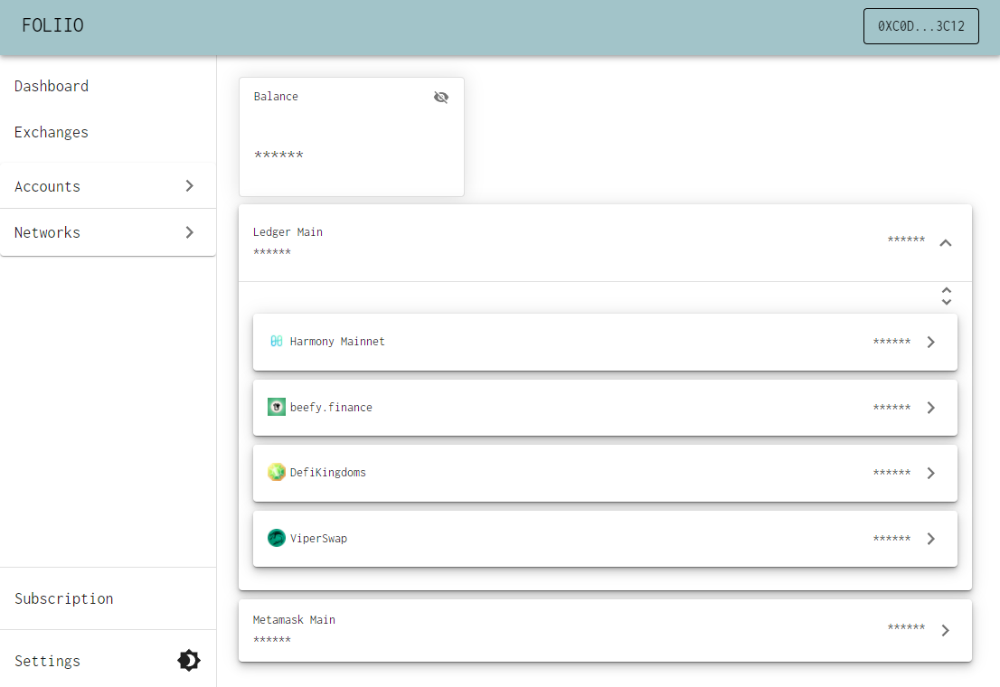

# Introduction

### What is foliio?

Foliio is a cross-chain portfolio monitoring platform that aggregates wallet balances and liquidity provisions into a unified dashboard. It allows users to monitor their digital assets in a central location without sacrificing anonymity.

### SaaS + DApp

Foliio is designed to function as a SaaS (software as a service) but is also a DApp (decentralized application). As it grows we will be adding a variety of free content as well as subscriber-only content to the platform. The initial release is primarily focused on portfolio management on Harmony Mainnet which will be a free feature.&#x20;

### Wallet-based Authentication

Rather than using login credentials to authenticate, users connect to the application using their wallet. Authentication is determined by checking if the connected account is an owner of a subscription token that has not expired. A single subscription allows you to track any number of wallets.&#x20;

Subscription tokens can be purchased through the foliio website or by interacting with the FoliioSubscriptionManager contract directly.

### Guides: Jump right in

Follow our handy guides to get started on the basics as quickly as possible:


[activating-a-subscription.md](guides/activating-a-subscription.md)



[configuring-an-account.md](guides/configuring-an-account.md)



[advanced-permissions.md](guides/advanced-permissions.md)



**Good to know:** your product docs aren't just a reference of all your features! use them to encourage folks to perform certain actions and discover the value in your product.


### Fundamentals: Dive a little deeper

Learn the fundamentals of MyProduct to get a deeper understanding of our main features:


[projects.md](fundamentals/projects.md)



[members.md](fundamentals/members.md)



[task-lists.md](fundamentals/task-lists.md)



[tasks.md](fundamentals/tasks.md)



**Good to know:** Splitting your product into fundamental concepts, objects, or areas can be a great way to let readers deep dive into the concepts that matter most to them. Combine guides with this approach to 'fundamentals' and you're well on your way to great documentation!

